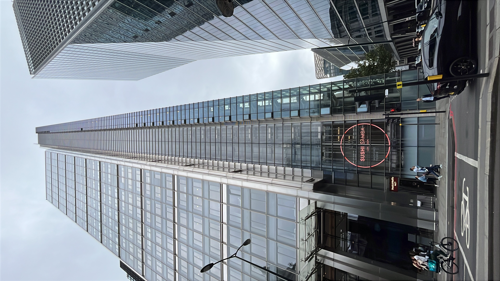

# The Bus

[Index](../index.md)

🇪🇸 Español  

Jueves 31 de julio - 20h58

Bueno, pues, aquí estamos de nuevo para contar las venturas y desventuras de este personaje entrañable. Con muchas ganas e incertidumbres por empezar las etapas del Camino Francés desde St. Jean Pier de port hasta León. ``El Camino 2.0''

Todavía son las 20:58 y me encuentro en el hostal "Safestay Elephant and Castle" en Londres. El día de hoy ha transcurrido sin más. Me levanté en mi casa de Falmouth a eso de las 7 am. Hice unos cambios en la maleta, aunque los auriculares que cogí pensando que eran más ligeros resultan que no funcionan. También, cuando estuve esperando al bus, me di cuenta de que me había olvidado del móvil español. En fin, de camino a la parada del bus, paré en el Super Co-op para comprar el desayuno y el almuerzo (porquerías varias). 

El viaje en bus fue muy largo; hasta la parada en Plymouth, todo bien. Ahí se montó un montón de gente, entre ellos unos viejos rockeros y una familia con muchos hijos, entre ellos uno con necesidades especiales. Lo llevé bastante bien y admiro la paciencia y el amor de esa madre, ya que en las últimas horas del trayecto los hijos se estaban desmadrando. El que estaba a mi lado no paraba de poner videos en el móvil en voz alta; al niño con necesidades especiales no se le entendía nada y no se callaba; solo la madre lo entendía. Al finalizar el trayecto, la mujer se disculpó a unos pasajeros que estaban en la fila de enferme. En fin, a mí me dolía un poquito la ampolla del pie derecho, que me la hice entrenando en Falmouth (mejor ahora que luego). Ya parece que se está curando.

Para pasar el tiempo más rápido y para aliviar un poco el sufrimiento mío, de los pasajeros y de todos en general, me puse a recitar mantras y, casi sin darme cuenta, entré en un estado que no me molestaba nada de lo que ocurría a mi alrededor. Con el "mala" pude contar unos 10 vuelas en la primera sesión hasta el área de servicio y unas 15 más en la segunda.

Al llegar a Victoria Station, nos bajamos muy poquitos y empecé a caminar hasta el lugar donde me encuentro. Mientras venía, iba pensando en el motivo del camino 2.0, ya que el primero fue como una búsqueda de mí mismo y fue la lanzadera de mis futuras andanzas. Ahora lo mismo con otra perspectiva, y es la de caminar para desmantelarme a mí mismo. Descubrir que la esencia de todos los seres es la misma: cuando haces algo a alguien, te lo haces a ti mismo en otra forma. 

Ha habido tres o cuatro acciones de las cuales me regocijo y dedico los méritos:

1.- Esperando al bus, he recogido unas gafas de una mujer.
2.- Al salir del bus he recogido basura que no era mía (era de mi otro yo)
3.- Le he indicado el camino a Victoria Station a una pareja que me preguntó.
4.- Limpie el inodoro público después de usarlo para que el usuario siguiente, mi yo en otra forma, se sienta más cómodo. 

¡También he chateado con Edna, que está en una etapa muy bonita buscando ser mamá, y bueno, creo que esto está bien por hoy! Qué guay volver a escribir.

—

🇬🇧 English  

Thursday 31 July – 20:58

Well then, here we are again to recount the fortunes and misfortunes of this endearing character. Full of excitement and uncertainty about starting the stages of the Camino Francés from St Jean Pied de Port to León. “El Camino 2.0”.

It is still 20:58, and I am in the “Safestay Elephant and Castle” hostel in London. Today has passed without much to report. I got up at my place in Falmouth at around 7 a.m. I made a few changes to my backpack, although the headphones I took, thinking they were lighter, did not work. Also, while I was waiting for the bus, I realised I had forgotten my Spanish mobile phone. Anyway, on the way to the bus stop, I stopped at the Co-op to buy breakfast and lunch (various bits of junk food).

The bus journey was very long; up to the stop in Plymouth,h everything was fine. There, many people got on, including some old rockers and a family with many children, one of whom had special needs. I coped fairly well, and I admire that mother’s patience and love, because in the last hours of the journey, the children were getting completely out of hand. The one sitting next to me wouldn’t stop playing videos on his phone out loud; the child with special needs couldn’t be understood at all and wouldn’t stop talking; only the mother understood him. At the end of the journey, the woman apologised to some passengers who were in the queue to get off. Anyway, my right foot blister — which I got while training in Falmouth (better now than later) — was aching a little. It already seems to be healing.

To make the time pass more quickly and to ease my own suffering, as well as that of the passengers and everyone in general, I started reciting mantras and, almost without realising it, I entered a state in which nothing that was happening around me bothered me at all. With the mala, I managed about 10 rounds in the first session up to the service area, and about 15 more in the second.

When I arrived at Victoria Station, only a few of us got off, and I started walking to where I am now. As I walked, I was thinking about the reason for Camino 2.0, since the first one was a kind of search for myself and became the launchpad for my future wanderings. Now it is the same, but from another perspective: walking in order to dismantle myself. To discover that the essence of all beings is the same — when you do something to someone else, you are doing it to yourself in another form.

There have been three or four actions that I take joy in, and dedicate the merits:

1. While waiting for the bus, I picked up a woman’s glasses.
2. When getting off the bus, I picked up rubbish that wasn’t mine (it belonged to my other self).
3. I gave directions to a couple who asked me how to get to Victoria Station.
4. I cleaned the public toilet after using it so that the next user — myself in another form — would feel more comfortable.

I’ve also been chatting with Edna, who is in a very beautiful stage of her life, hoping to become a mum, and well, I think that’s enough for today. How great it feels to be writing again.

