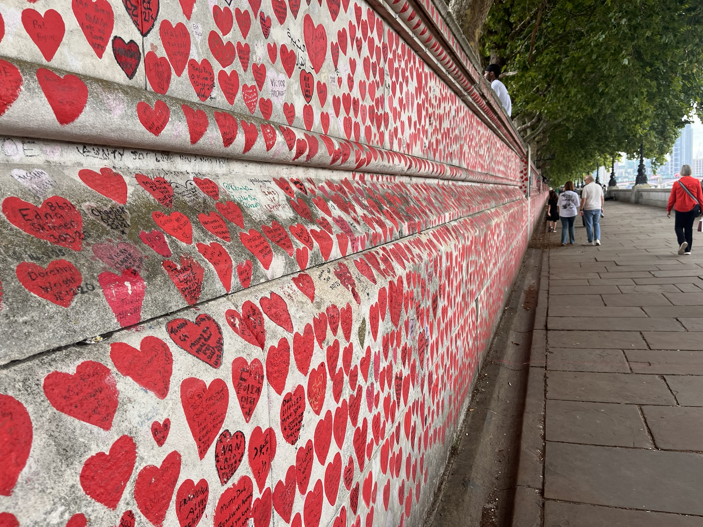
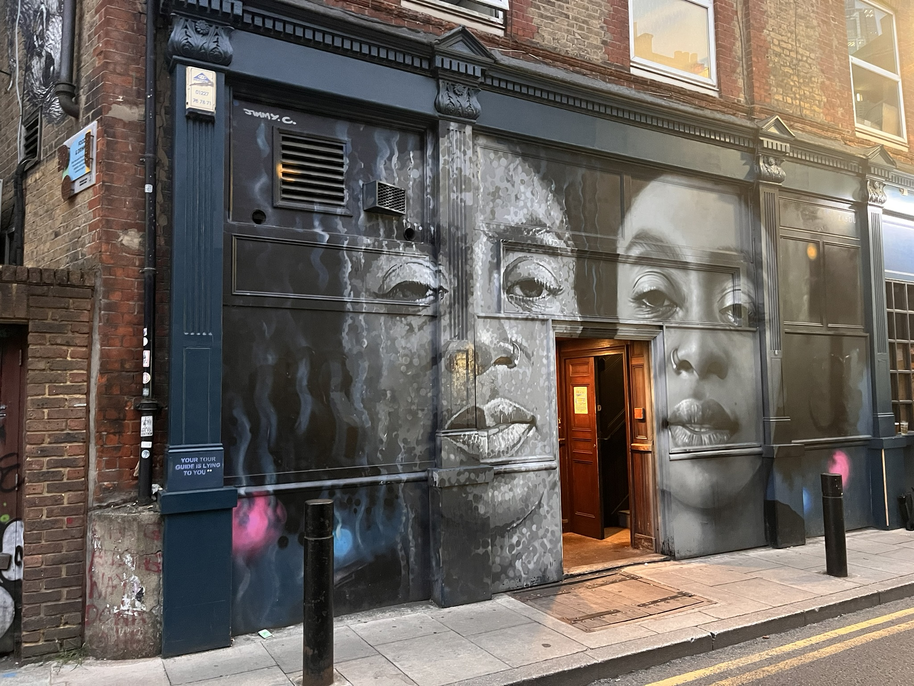

# Viernes 1 de Agosto

[Indice](../index.md)

## Destacados:

- Caminado 42,104 pasos
- Visitado la librería de la película Notting Hill
- Comido en japonés "Tokyo eat"
- Tour de jack el destripador
- Massage Thailandes

Son las 23:31 y ya estoy de vuelta en la cama del hostal, duchado y aseado, listo para escribir un poco sobre el día de hoy. 
Me desperté a las 4 y algo con un ligero dolor de encía; aproveché para ir al baño y seguir durmiendo. Sobre las 8 empezaron a despertar los compañeros de habitación, 
Por cierto, había uno que roncaba una cosa mala, pero como no tenía los tapones a mano, pues me tuve que aguantar. Después de separar, solo quedaba uno en la habitación que supongo que había estado toda la noche fuera. 
Bajé a desayunar sobre las 9 y ya no quedaba nada de comida caliente. Me hice un té, una tostada integral con "baked beans" y mantequilla, típico de los ingleses, y un yogurt con copos de avena. Me quedé con hambre y cogí una tostada más con queso.
Todo eso por £8. Mañana creo que haré brunch fuera del hostal.

Al salir, pasé por Coop y compré un agua y un plátano. Antes de salir, no tenía bien definido un plan, así que empecé a leer la guía que me pasaron los del tour. Baraje opciones del mercado de comida que me recomendó el Tutu, museos, espectáculos... Al final me decidí por ir a ver la librería de la peli Notting Hill.
**Eso demuestra la necesidad de fijar un objetivo; da igual cuál sea, pero es lo necesario para empezar a moverse; sin objetivo o meta no hay ni camino ni rumbo ni movimiento.**

Una vez el destrino, ya tenía la ruta con ayuda del GPS. Aunque no le hice mucho caso. Empecé a caminar y pasé por una calle con muchas garitas de comida latinoamericana (estaría bien probar). Luego pasé por debajo de un túnel lleno de grafitis súper bien hechos y ya se veía mucha gente. Continué hacia el río y la idea era cruzar el puente del Big Ben. 
Hice una foto de la casa de los Lords y me impactó el muro lleno de corazones con los nombres de las víctimas del COVID. 

Fotografia scada en South Bank a las 11:24.

En los grafitis había otro muy significativo que decía así: 

> "Todo lo que pierdo crea espacio para todo lo que necesito", dijo Pooh.
>
> "Eso es profundo", dijo Piglet.
>
> "¿Encontraste Rizlas…, Porky?", dijo Pooh.

En fin, soltar es súper importante para que lo nuevo tenga lugar. 

Winnie the Pooh porreta.

Magic woman, grafity en Waterloo a las 11:08.

Pero después de pasar el puente necesité un baño urgente. Lo encontré con facilidad en un restaurante de esta franquicia. Llegué a Hyde Park y flipé con lo grande que es. Lo crucé casi entero. Pasé junto al lago y, justo antes de salir, ya tenía hambre, así que le pregunté a Laura por un japonés. Resulta que en Notting Hill Gate había uno y comí ahí. Riquísimo. 
Pasé por la calle porque había un mercado. Y luego me crucé todo Londres siguiendo Oxford Street; ya el pie me empezaba a doler de nuevo, paré pa buscar un baño y entré en un edificio tipo Corte Inglés, pero más pijo todavía. Selfridges. Flipe con la cantidad de gente poch. Un poquito más adelante, paré para revisar el pie y justo había una parada en la que unos recitaban el Corán para sanar. Seguí hasta Tower Hill, donde empecé el tour. 

Inscripción al pie de las ruinas del muro romano en Londres, punto de partida del tour.

Súper interesante la historia de las 5 mujeres asesinadas. Creo que voy a tener pesadillas. Durante el camino di una moneda. Había mucha gente con letreros que tenían hambre y vi uno con una burger. Pensé en darle algo de comer al próximo que viera con el cartel, pero no vi ninguno. 
Al acabar el tour, vi un lugar de masajes que me vino de maravilla ya que tenía las piernas súper cargadas y la espalda muy rígida. Por el camino compré unos auriculares. Y me voy a dormir ya que es tarde. Mañana me lo tomaré muy de relax. 
Bona nit.

Grafity de una de las 5 Mujeres.

