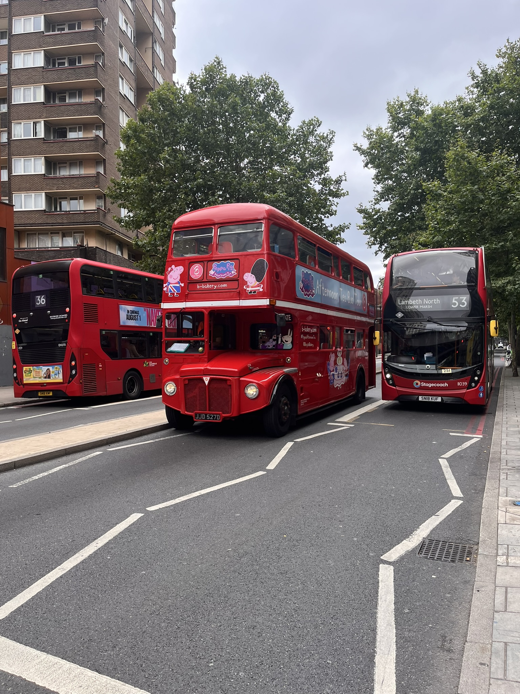

# Puestos de comida, salsa y medicina china

[indice](../index.md)

## Domingo 3 de Agosto

Hoy, se podría decir que ha sido un día muy bueno. Como siempre, son las 23:26; estoy en la cama del hostal, ya duchado y con la ropa lavada, y listo para reflexionar sobre el día de hoy. 

Me desperté con un poco de dolor en el bajo vientre y en la espalda. Estaba un poco preocupado por eso y creí que era por la alimentación y por no hacer de vientre. Decidí entonces ir al Co-op y comprar un porridge ya hecho, que solo necesita agua caliente y un plátano. Cuando fui a pedir agua al hostal, no había nadie en la barra; la recepcionista estaba muy atareada. Entonces me acerqué a la zona donde unos minutos antes se había hecho el desayuno. Me encontré con un tipo que estaba limpiando y le pedí agua. Me dijo que le dijera a la recepcionista y yo le dije que estaba muy ocupada. Él me dijo: «Bueno, yo también». 

Ya no insistí más y me fui a la barra a esperar; al poco rato, vino una chica y me dio agua caliente. 

Mientras desayunaba, había un grupo súper grande de personas con polos azules; debía ser algún grupo de algo, con gente de todas las edades y muy diversa. Había uno que no paraba de fumar con dentadura postiza: se la sacaba y se la ponía todo el rato. ¡Qué asco!

Mientras desayunaba, decidí ir a visitar el "Borough Market" que solo está a 20 minutos caminando. Fui y había un montón de gente haciendo cola por todo: paella, fresas con chocolate y cosas así. Era súper caro y muy enfocado al turismo. Entonces decidí continuar caminando hasta el "London Field Market". Lo encontré después de caminar una hora; pasé por El Sushi Samba en la calle Bishop Gate. Pasé por Liverpool Street y todo el mundo venía con plantas (muy curioso).

Sushi Samba.

Al llegar, me sorprendió gratamente; había gente, pero no estaba tan masificado. Después de recorrerlo de arriba a abajo, decidí comer en una pizzería. Me senté bastante bien; de postre, me pedí un helado de miel y jengibre que me lo comí de camino al parque. En el parque había un lugar donde la gente entrenaba calistenia, muy fibrados. Encontré un lugar donde sentarme a meditar, justo enfrente de un campo de críquet, donde estaban jugando. nunca habia visto un partido de critcket antes, todos de blanco. 

Partido de críquet.

Después hice unos pocos estiramientos para la espalda, cogí el tren con el objetivo de ir a un bar a bailar bachata, bajé en Liverpool Street y de ahí cogí la línea roja y paré en Tottenham Court Road. De ahí ya estás en el Soho y lo encontré. Me dijeron que las clases no empezaban hasta las 6, pero solo eran las 4:30. Entonces decidí pasear; llegué al barrio chino y encontré un médico. Le pedí un masaje de reflexología podal, que me vino como anillo al dedo.

Al salir me encontré con que estaba lloviendo a raudales, pero paró a los 10 o 15 minutos. El tío quería que me diera otro masaje mientras esperaba. Llegué al bar y tuve que esperar una hora; había unos tipos rodando una escena de una película o de una serie. Muy raro. Muy amateur. Al empezar me apunté a bachata y a salsa. Estuvo muy divertido y conoci un par de chicas muy interesantes, pero al acabar noles dije nada. como ya era tarde y estaba cansado decidi volver al hostal ya que manana tengo que coger el avion para ir a Bilbao y empezar con el Apapacho Fest. Estoy pensando que según cómo vaya mañana voy a tener unos días de descanso de escribir y retomar el día 10 al empezar el camino o tal vez no, ya veremos. 

Tipico Autobus Londinense en Elephant and Castle.

En fin, para cenar no tenía muy claro qué hacer y al final me decidí por la opción sana, fruta, huevos duros y un batido de frutas del bosque rojas. ¡Así! Al salir de la estación de metro en Tottenham, me encontré con un edificio en el cual dentro había proyecciones en las paredes y en el techo de cosas súper chulas y con música, una experiencia para los sentidos muy alucinante. Veías a la gente ahí parados mirando y a los niños flipando. Al final me fui, pero me hubiera quedado más tiempo. A si! Al salir del baile, ya no tenía ningún dolor de espalda; creo que me hacía falta mover el esqueleto y el masaje de los pies hace milagros. Creo que esto resume el día bastante bien. Bona nit.

<video src="https://github.com/P-4all/Camino2.0/images/20250803/20250803_Tottenham_court_Road.mp4" controls width="600"></video>
