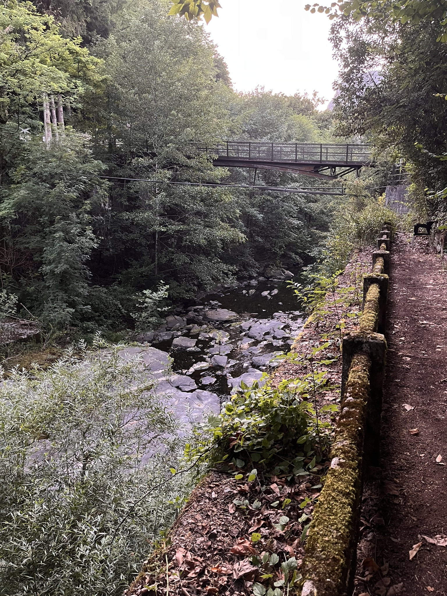

# Ladrones, astrología y otras movidas.

[indice](../index.md)

## Viernes 8 de agosto

### Entrada 1:

 Son las 10:42 de la mañana; hay una movida, bueno, más de una. Solo tengo 20 minutos para la siguiente dinámica titulada "Liberación emocional ERTM". La primera movida más material es que ayer, cuando iba a ducharme, me encontré con una vecina de tienda y la vi muy apurada porque tenía agua en la tienda. Le ayudé un poco y me pidió un martillo. Se lo pedí a un hombre que tenía uno. Al rato vino una amiga de ella y, como ya no necesitaban ayuda, me fui y les di indicaciones de dónde tenían que devolver el martillo. 

 Esta mañana fui a comprobar si al hombre le habían devuelto el martillo y me dijo que no. Después de comprobar con la chica, me dijo que su amiga lo había devuelto a otra tienda. A todo esto, había una chica en la tienda de al lado y le pregunté y me dijo, muy fresca, ella, que no sabía nada ni del martillo ni de la chica, y le dije que cómo puede ser si es su vecina de tienda que no sepa nada. Y me dice: no es mi vecina, esta no es mi tienda, yo estoy aquí robando. Supongo que lo diría de broma.

 Las otras movidas son de índole emocional; tienen que ver con mi problema de dejarme ser amado. Hay una chica con la que, desde el primer día en la dinámica, coincidimos y lo pasamos muy bien. Aunque es muy guapa, alegre, jovial, yo siempre busco defectos; aunque no la conozco de nada, creo que es buena gente. Pero creo que no es mi tipo de mujer; eso lo digo quizás por mi miedo a abrirme a ella y dejarme ser amado. Me da miedo que se cuelguen de mí porque si en algún momento pierdo el interés o no estoy a gusto, no sabría cómo alejarme sin hacer daño. Tengo que hablar con ella para aclarar las cosas.

 En la dinámica de ayer coincidimos y se me acercó, sentándose enfrente de mí de manera muy insinuante para hacer la dinámica. Me dijo que tenía un buen trabajo, un piso y la faltaba un novio, una persona con quien compartir su viaje. ¿Quizás pudiera ser ella? ¿Qué vive en Granada y yo en Falmouth? Tendría que venir a Granada y así estar cerca de mis padres. Pero luego, cuando mueran mis padres, solo tendré a ella, que no sé si es mejor que solo. Al menos estaré conmigo y con ella… ¿Y si soy yo quien se declare abiertamente a alguna chica de mi tipo? ¿Y enfrentarme al miedo al rechazo? Quizás mejor una más cerca, en Falmouth.

# Entrada 2:

 Son las 20:37 y acabo de tener un día súper interesante; como tengo poco tiempo, voy a intentar ser breve.

 El taller de la manana que ne me acuerdo del nombre, ha sido una pasada y creo que ha conseguido lo que qeria que era desprenderme del ego, ese falso yo, darme cuenta de que todo lo que me rodea es simplemnte una interpretacion de mi esado mental con la informacion que recibe de los agregados ( sentidos sensoriales + mental).

 La práctica, taller o meditación ha empezado todos tumbados en el suelo, en círculo, en contacto con la tierra, y visualizar el momento en que desde el cielo baja una energía en forma de luz, punto de luz o rayo, y penetra en el preciso instante en que el espermatozoide fecunda el óvulo, pasando por la etapa de feto, el proceso de salir del útero, las primeras caras, sensaciones, de repente. Surge dentro de nosotros el animal de poder; en mi caso, un oso pardo que luego evolucionó a un león. Más tarde, vi un árbol muy alto y empecé a venerarlo como representación de toda la energía de los universos. Lo abracé y me subí en él como un oso perezoso; luego, la imagen de un león vino a mí y mis movimientos empezaron a ser más tranquilos, calmados, majestuosos. 
 Para terminar en forma humana parado sin camiseta y sin gafas enfrente del sol. Simbolizando la clara luz. La cual es la esencia de todos los seres sintientes. 

 Fue mi interesante el hecho de que cuando bajaba la cabeza todo se volvia oscuro peroq estab ajusto en un lugar donde la sombre delos arboles tapaba esa luz. Jugué un poco con eso y decidí quedarme tranquilo al alumbrarme con el sol. Luego, para terminar con los ojos entreabiertos, caminamos y no nos encontrábamos con los demás seres. Los cuales identifico todos por su naturaleza pura y perfecta de luz clara. Habnia gente que cuxando sus miradas nos abrazabamos y de repente me choque con una chica terapetuo de masjaes que luego mas tarde en la piscina me dio las gracias y me exoplico suviaje. Esaba atrpada en un vortice de segun la vabala "la ruleta de la fortuna" y cuando se choco conmigo le ayude a salir de esa espiral. Después de salir, me contó que se fue a registrarse contra un árbol.

 Para terminar el taller todos sentados en circulo exprese mi opinion o mejor dicho mi experiencia y dije: "gracias a todos proque vi en cada uno de ellos que todos eran seres de luz includido yo y me pude identificar en cada uno de ellos, lo que me da a pensar que podria ser en universos paralelos yo estoy viviendo todas mis reencoarnaciones y me pude ver yo en otras existencias, como mujer, como hombre, mas joven, mas viejo. mas feo mas guapo etc. todos clara luz en difernetes recipientres que solo son la interpretacion de mi mente".
 Hoy tienes mucho más que explicar. El pensamiento que me cruza la mente ahora es que la gente aquí, creo, está empezando a cansarse y se nota un ambiente hostil, pero solo en ciertas personas. ( a percepcion mia) Hay grupitos que se van creando, parejas,...
 Después del taller hablé con el francés de la música y me habló de los árboles y del lugar mágico. Me dijo que fuera a pasear por un pasillo de árboles para ver qué energía encontraba. AL final del pasillo había una chica, de cuyo nombre no me acuerdo, con la que hablamos un montón. Muy guapa. le conte cosas muy intimas y muy privadas, pero lo lleve de una forma muy natural, la veredad creo que la mejor converacion que he tenido en mucho tiempo. Es de Sant Celoni y se llama igual que la chica con la que me chocé en el taller, ¿qué casualidad?

 

Río junto a la vereda de atrás entre la sala externa y la zona de camping

 El taller de la tarde, no me apetecian para nada y despues de probar uno con una Japonesa que una y otra vez nos hacia hacer el imbecil para relajarnos y cantar, y sin saber la finalidad del practica llamda "ToGo" me sali y me encontre con otra mujer igual que yo, nos sentamos a tomar un te con una artesana que tejia cazadores de suenos. 

 Al rato vino el astrólogo, "Sevillano", y hablando sobre su vida salieron temas de esoterismo, ciencias ocultas, y yo compartí una experiencia que solo unos pocos saben. Lo de la tabla de la Ouija. 28CC, de los 28 a los 29, "Camino de Santiago Original" cambió mi vida. Muerte del viejo continuo mental e inicio del presente continuo mental. mejor dicho cambo de rumbo, que gracias a eso estoy qui.

 También me hizo una carta astral y, con lo poco que hemos compartido, supo cuál es mi signo del zodíaco. Además, me dijo que tengo la luna en libra . Lo cual significa que soy una persona que busca el equilibrio, muy tierna y amorosa, que no le gustan los conflictos y que trata de evitarlos, y que soy muy indeciso. 100\%.

 

Carta aastral

 Me duele  o me molesta un poco el cuello y la espalda alta de hacer tanto con el animal, ya que he estado dando volteretas sin ningún control. Como decía, creo que ya he tenido bastante de talleres. Voy a probar, pero si veo que no va conmigo, me salgo y ya. 

 También he comprado jabones en pastillas de ortigas. En el camino, justo en el tenderete, me he encontrado con uno de los pioneros del camino, quien me ha dado buenos consejos.
 Esta noche toca "El Bhuio". Me asomaré a ver qué tal, pero voy a ir con un rollo total de tranquis.

  # Entrada 3:
 
 Son las 22:46 acabo de llegar a la tienda despues de cenar y primero en la cola ha veindo los organizadores al comdedor exterior y despues de cruzar miradas me he atrevido a intercambiar unas palabras de agradecimiento, sin embargo al lado mio habia una chica que parecia muy enfadada y le estaba no solo apuntando en las cosas posibles a mejorar sino que le reprochaba el que no dieran solutiones, ademas cuando el le dijo que enfocara en lo positivo eso causo aun mas enfado ( aunque tiene razon, creo que como organizador de un evento asi podria tener mas mano izquierd en estas situaciones, ya que hay gente que no atienden a razones.)

 En principio no quería cenar mucho, pero una vez ahí me he animado y he terminado cenando. Durante la cena me senté enfrente de un señor, Antonio, que me explicó varias cosas sobre festivales de este tipo y que había estado por las playas de Cádiz, pero lo más interesante viene ahora. 

 Una chica, de nombre desconocido, me invitó a escribir; le conté mi experiencia de esta mañana y me dijo que el oso simboliza sabiduría y que he venido a dejar huella. Además, durante la conversación me he acordado de una parte que no había escrito antes.

 Durante la meditación con los ojos abiertos me he enfocado en el cielo  y, en el fondo del todo, veía líneas blancas formando valdosas hexagonales muy sutiles; luego esas líneas se movían y se hacían como estrellas, como de mosaico, de valdosas azules con líneas blancas. Entonces mi mente ha captado la idea de quee staba dentre de una cupula como en el la pelicula del show de truman.

 

La sala externa

